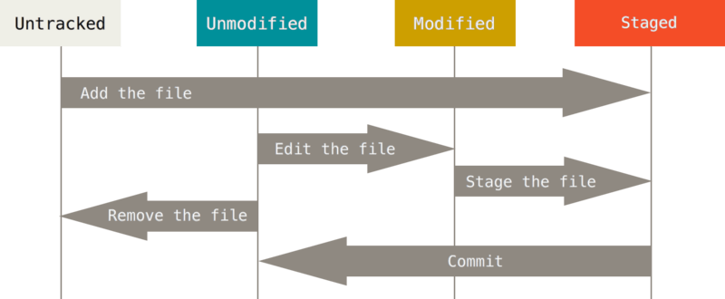

## Commit
A Git commit is a snapshot of your project's source code at a specific point in time. It is a way of saving your work so that you can revert to it if necessary. It is also a way of sharing your work with others so that they can collaborate on it.

#### Viewing commit history
-> ```git log```

### Adding a commit



#### To understand the commit staging, use 

-> ```git status```

#### It shall show you where the state of the commit is. To add unstaged files, use

-> ```git add```

#### Once done, use the following command to commit to the local repository, along with a message

-> ```git commit -m "Message here"```


## Deeper Dive
Please refer to the documentation for more information.
- https://git-scm.com/book/en/v2/Git-Basics-Recording-Changes-to-the-Repository