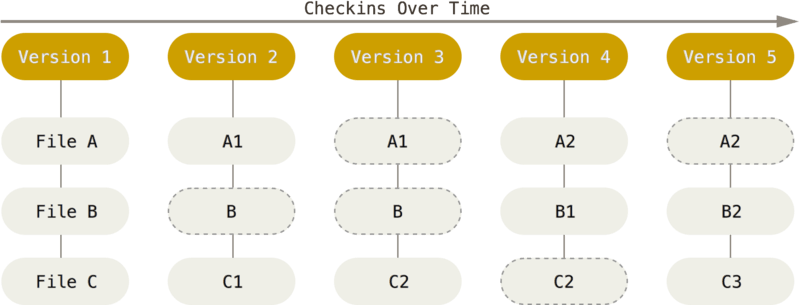

## Git in a nutshell

Git, every time you commit, or save the state of your project, Git basically takes a picture of what all your files look like at that moment and stores a reference to that snapshot. To be efficient, if files have not changed, Git doesn’t store the file again, just a link to the previous identical file it has already stored. Git thinks about its data more like a stream of snapshots.

## Three States

- You modify files in your working tree.
- You selectively stage just those changes you want to be part of your next commit, which adds only those changes to the staging area.
- You do a commit, which takes the files as they are in the staging area and stores that snapshot permanently to your Git directory.

 