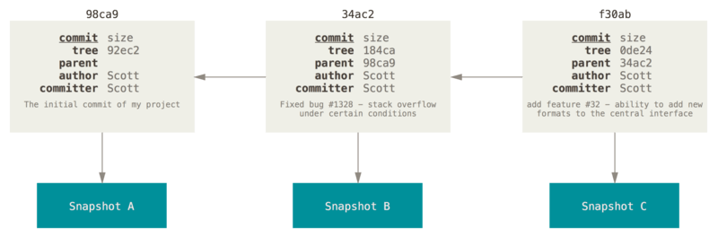
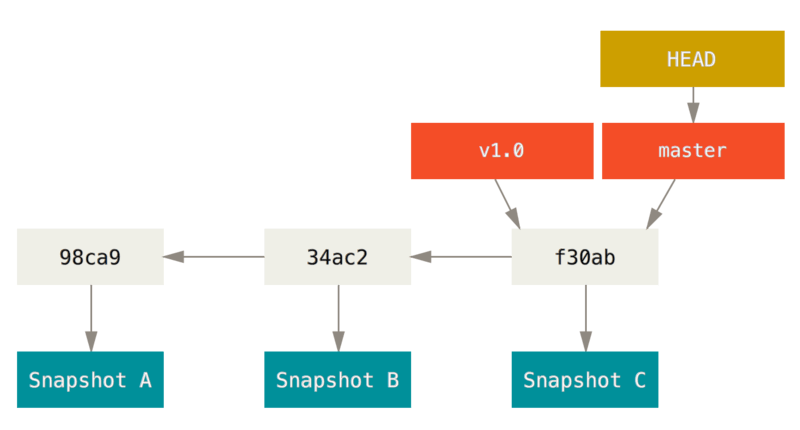
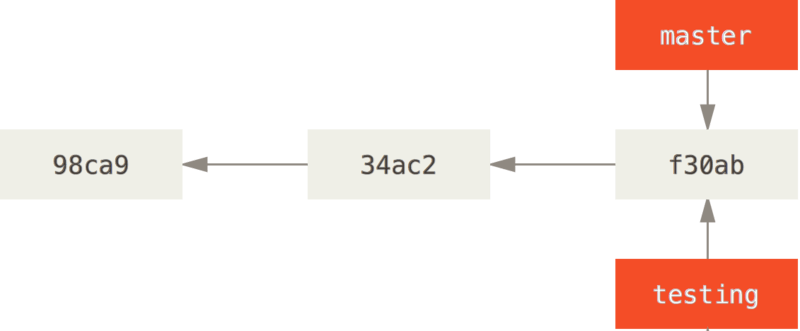
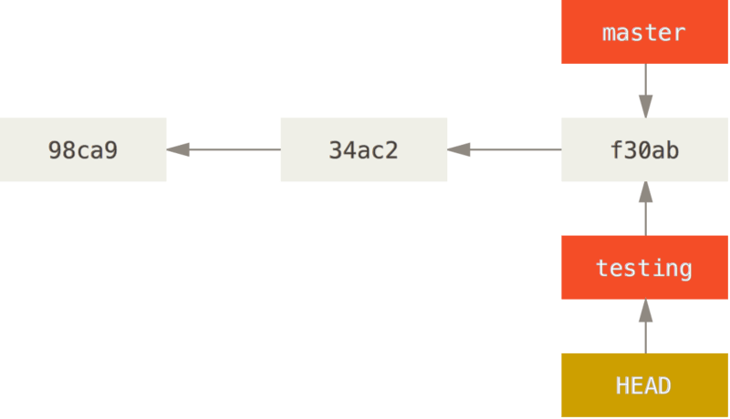

## Branches

Branches are the "killer feature" of Git. They allow for working with different branches - merge operations, while being really lightweight. 

Understanding and mastering this feature gives you a powerful and unique tool and can entirely change the way that you develop.


### Commit Tree



Consider the commit tree given above, which contains the commit references, author and parent pointers. This makes it easy to track the commit tree.

### Head, and a Branch

A branch in Git is simply a lightweight movable pointer to one of these commits. The default branch name in Git is `master`. As you start making commits, you’re given a `master` branch that points to the last commit you made. Every time you commit, the master branch pointer moves forward automatically.



#### Creating a new branch

Well, doing so creates a new pointer for you to move around.

-> ```git branch <branch_name_here>```



#### How to know which branch we're currently on?

There's a special pointer called `HEAD`.


#### Switch to a branch

To switch to an existing branch, use the following command

-> ```git checkout <branch_name_here>```

This moves `HEAD` to point to the other branch.

You could also create a new branch and directly checkout to that branch by this following command

-> ```git checkout -b <branch_name_here>```





##### Notes

- The `HEAD` branch moves forward when a commit is made
- `HEAD` moves when you checkout

#### Simulation of Commits based on branches


- After one commit through the `master` branch, the result would look like this

