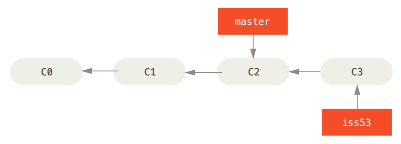
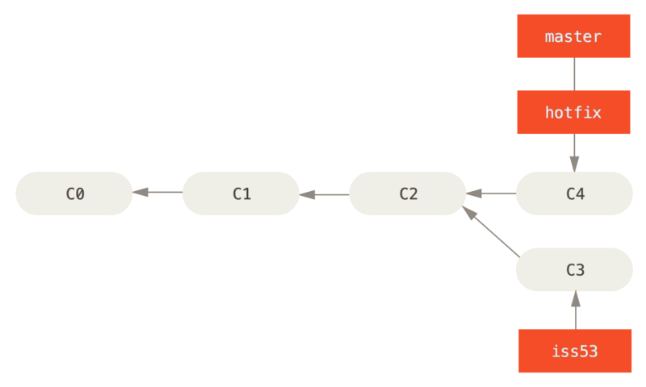

## Merging

After working on particular branches, or having new implementations to be combined with the original branch, we use the concept of merging.

Let's consider the following situation

You're working on a project with a `master` branch, You're getting on an issue, let's consider issue #53. Now, you're going to do

-> ```git checkout -b iss53```

Once you've worked on the issue, you'll commit with a message.

-> ```git add .```

-> ```git commit -m "fix(footer): introduced new footer as replacement"```

Once it's done, your commit tree would look like this:




You suddlenly have an hotfix to make. To checkout and create a branch for the hotfix, you'll first move back to the `master` branch to base a new branch for the hotfix.

-> ```git checkout master```

-> ```git checkout -b hotfix```

Once you've worked on the hotfix, you'll commit with a message on the same branch.

-> ```git add .```

-> ```git commit -m "fix(hotfix): bumped dependency to clear conflict"```

Once that's done, your commit tree would look like this:


#### Merging a branch to the belonging brnach

Since your `hotfix` branch needs to be put on production (`master` branch), we'll be merging it immediately onto master.

First, you need to be in `master` branch to merge `hotfix` with it.

-> ```git checkout master```

Now, let's merge `hotfix` with the following command

-> ```git merge hotfix```

Now, the commit tree would look like this:



And since the work on hotfix is done, you can delete the branch.

-> ```git branch -d hotfix```


##### Note

- Merging without the consideration of the files changed is dangerous, while also being unavoidable in many cases.
- Merge conflicts occur when changes take place across the same file in different branches, and when they are merged together.
- For example, take the `hotfix` and `iss53` branches. Let's say `hotfix` was working on `package.json` file, and `iss53` also involves working on the `package.json` file. Now, when you merge `hotfix` to `master`, and the `iss53` branch is still not merged, it causes a merge conflict since git does not know how to handle the conflict between the same file in different merges.
- Merge conflicts can be handled properly by rebasing and clearing the conflicts.
