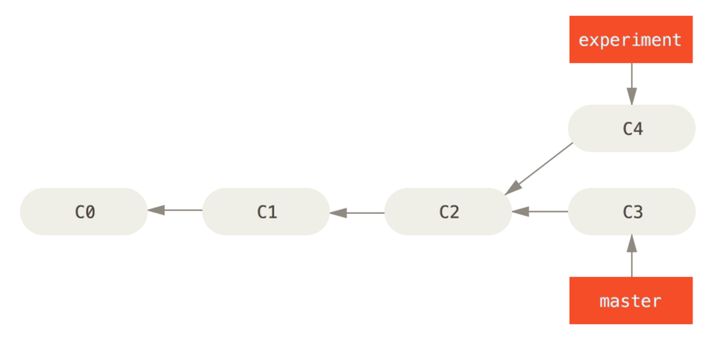
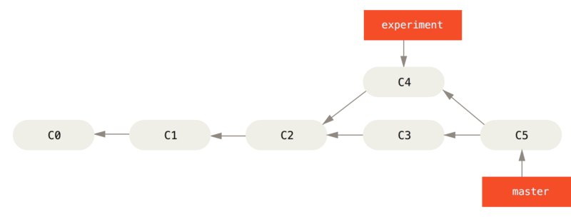
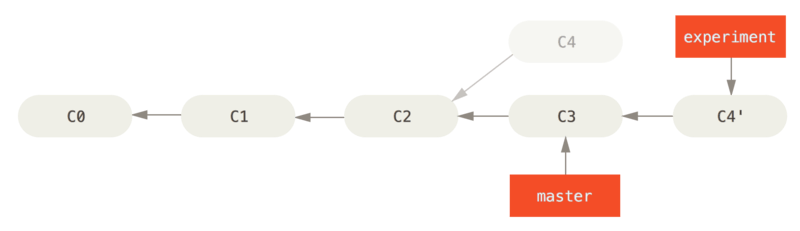
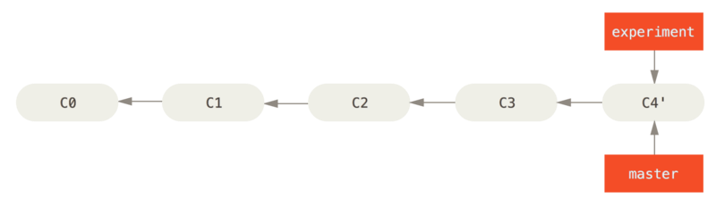

## Rebase

In Git, there are two major ways to combine and integrate changes together into a branch. They are merging, and rebasing.

Let's consider the following situation from the merging lesson.

You've worked on a particular issue, but you've suddenly merged another hotfix to the original branch. You're going back to the issue and finish working, but this is how the commit tree looks like:



#### Using the normal merge command

-> ```git checkout master```

-> ```git merge experiment```

Should work. But the merge command will create a new commit, and make the commit tree look like this:



#### Using the rebase command

But there is a better way of doing the merge. It is, by using rebase.

-> ```git checkout experiment```

-> ```git rebase master```

This will rebase the `experiment` branch onto the `master` branch.



Now that we've rebased it, we can merge it with ease.

-> ```git checkout master```

-> ```git merge experiment```

Finally, the commit tree would look like this!




##### Notes

- Use rebase carefully. As much as it is useful, it can be dangerous to use the wrong command while rebasing, and it could end up at losses of your branch commits. 
- With the interactive editor or the CLI, you can use the commands Squash, Pick and other ones to make sure you select how your rebase works.

##### Interactive commands while rebasing

- `pick` simply means that the commit is included. Rearranging the order of the pick commands changes the order of the commits when the rebase is underway. If you choose not to include a commit, you should delete the entire line. 
- The `reword` command is similar to pick, but after you use it, the rebase process will pause and give you a chance to alter the commit message. Any changes made by the commit are not affected.
- If you choose to `edit` a commit, you'll be given the chance to amend the commit, meaning that you can add or change the commit entirely. You can also make more commits before you continue the rebase. This allows you to split a large commit into smaller ones, or, remove erroneous changes made in a commit.
- `squash` lets you combine two or more commits into a single commit. A commit is squashed into the commit above it. Git gives you the chance to write a new commit message describing both changes.
- `fixup` is similar to squash, but the commit to be merged has its message discarded. The commit is simply merged into the commit above it, and the earlier commit's message is used to describe both changes.